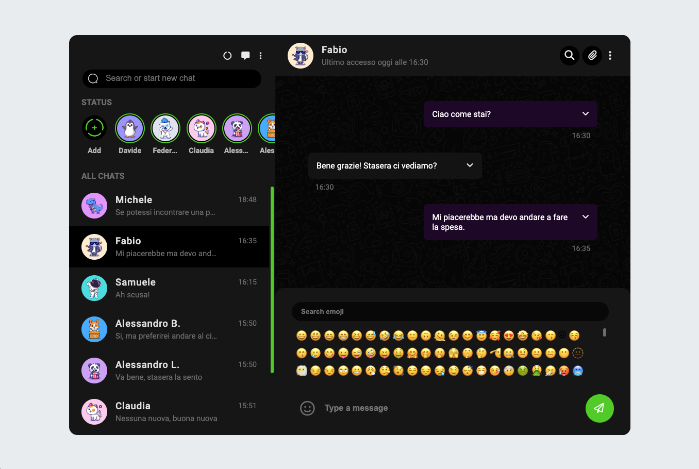

# Boolzapp - a (not very) innovative messaging platform
[Live Version](https://boolzapp2.netlify.app/) 👀

## Milestone 1
- Replica della grafica con la possibilità di avere messaggi scritti dall’utente (verdi) e
dall’interlocutore (bianco) assegnando due classi CSS diverse
- Visualizzazione dinamica della lista contatti: tramite la direttiva v-for, visualizzare
nome e immagine di ogni contatto

## Milestone 2
- Visualizzazione dinamica dei messaggi: tramite la direttiva v-for, visualizzare tutti i
messaggi relativi al contatto attivo all’interno del pannello della conversazione
- Click sul contatto mostra la conversazione del contatto cliccato

## Milestone 3
- Aggiunta di un messaggio: l’utente scrive un testo nella parte bassa e digitando
“enter” il testo viene aggiunto al thread sopra, come messaggio verde
- Risposta dall’interlocutore: ad ogni inserimento di un messaggio, l’utente riceverà
un “ok” come risposta, che apparirà dopo 1 secondo.

## Milestone 4
- Ricerca utenti: scrivendo qualcosa nell’input a sinistra, vengono visualizzati solo i
contatti il cui nome contiene le lettere inserite (es, Marco, Matteo Martina -> Scrivo
“mar” rimangono solo Marco e Martina)

## Milestone 5 - opzionale
- Cancella messaggio: cliccando sul messaggio appare un menu a tendina che
permette di cancellare il messaggio selezionato
- Visualizzazione ora e ultimo messaggio inviato/ricevuto nella lista dei contatti

# Bonus
- Creazione nuovo design
- Aggiunta delle emoji tramite menu a comparsa
- Aggiunta dell'orario dell'ultimo accesso prendedolo dal orario dell'ultimo messaggio ricevuto
- La chat scorre verso il basso all'aggiunta di un nuovo messaggio rendendo sempre visibili i messaggi più recenti 
- La chat più recente si sposta in cima alla lista dei contatti

